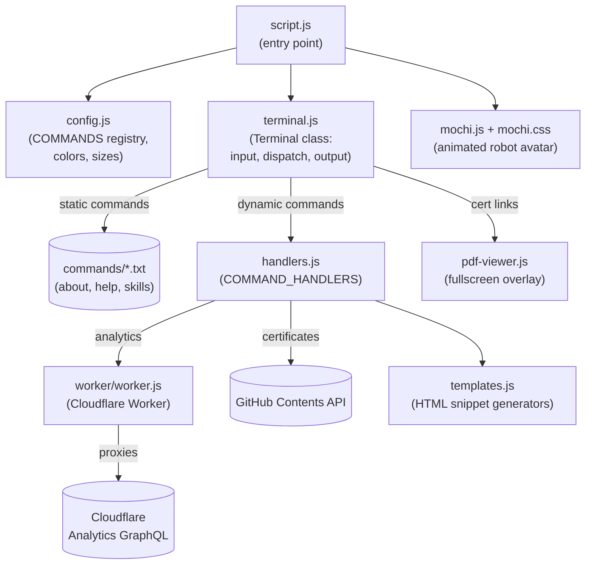

# oleksiisedun.com

Personal portfolio site, built as an interactive terminal emulator in the browser. Visitors type commands to explore info about me — work, projects, contact, and more.

Live at [oleksiisedun.com](https://oleksiisedun.com).

## Features

- Terminal-style UI with a retro CRT monitor aesthetic
- Commands: `help`, `about`, `skills`, `analytics`, `smoking`, `certificates`, `clear`
- Site analytics proxied through a Cloudflare Worker
- Certificate PDFs previewed in an in-page overlay

## Tech

Plain HTML, CSS, and vanilla JavaScript. No framework, no build step — just static files served directly.

## Architecture

`script.js` bootstraps the app by reading `config.js` and wiring CSS variables, then instantiates `Terminal` and `MochiRobot`. `Terminal` dispatches typed commands: static commands fetch `.txt` files from `commands/`; dynamic ones delegate to handlers in `handlers.js`. The `certificates` handler hits the GitHub Contents API; `analytics` calls the Cloudflare Worker proxy; `smoking` is self-contained. Certificate links open a PDF preview via `pdf-viewer.js`.



## Run locally

```
npm install
npm run dev   # serves the static site via `serve .`
```

## Deployment

- The static site deploys via GitHub Pages (custom domain in `CNAME`).
- `worker/worker.js` is a separate Cloudflare Worker, deployed independently — it's not part of the static site build.

## Built with AI

This site was built entirely with [Claude Code](https://claude.ai/code).
