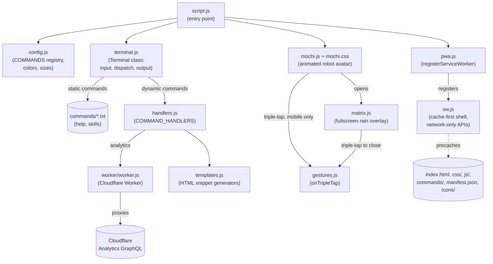

# oleksiisedun.com

Personal portfolio site, built as an interactive terminal emulator in the browser. Visitors type commands to explore info about me — work, projects, contact, and more.

Live at [oleksiisedun.com](https://oleksiisedun.com).

## Features

- Terminal-style UI with a retro CRT monitor aesthetic
- Commands: `help`, `skills`, `analytics`, `trackers`, `clear`
- Site analytics proxied through a Cloudflare Worker
- Installable PWA: the terminal shell works offline; analytics always fetches live
- Easter egg: triple-tap the Mochi robot on mobile for a fullscreen Matrix digital rain effect; triple-tap anywhere to dismiss

## Tech

Plain HTML, CSS, and vanilla JavaScript. No framework, no build step — just static files served directly.

## Architecture

`script.js` bootstraps the app by reading `config.js` and wiring CSS variables, then instantiates `Terminal` and `MochiRobot`, and calls `registerServiceWorker()` from `pwa.js`. `Terminal` dispatches typed commands: static commands fetch `.txt` files from `commands/`; dynamic ones delegate to handlers in `handlers.js`. The `analytics` handler calls the Cloudflare Worker proxy; `trackers` is self-contained. On mobile, `MochiRobot` also wires up a triple-tap easter egg (via the shared `gestures.js` tap detector) that opens a fullscreen Matrix rain overlay from `matrix.js`. `sw.js` caches the static shell for offline use and always lets analytics requests go straight to the network.



## Run locally

```
npm install
npm run dev     # serves the static site via `serve .`
npm run check   # lint, CSS lint, type check, format check, service-worker check, unit tests
```

See [CLAUDE.md](CLAUDE.md#checks) for what each check covers.

## Decision records

Non-obvious design choices are documented in [docs/decisions/](docs/decisions/).

## Deployment

- The static site (`src/`) deploys via GitHub Pages using `.github/workflows/deploy.yml`, which uploads `src/` as the Pages artifact (Pages source must be set to "GitHub Actions"). The custom domain lives in `src/CNAME`.
- `worker/worker.js` is a separate Cloudflare Worker, deployed independently — it's not part of the static site build.
